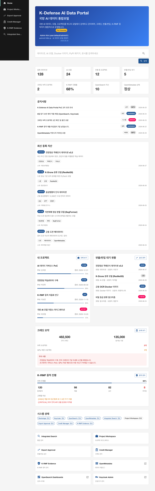
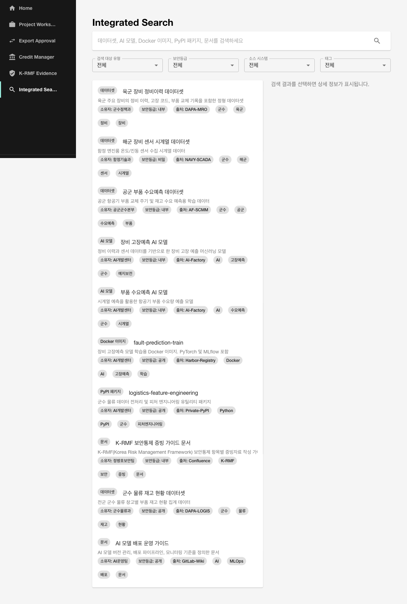
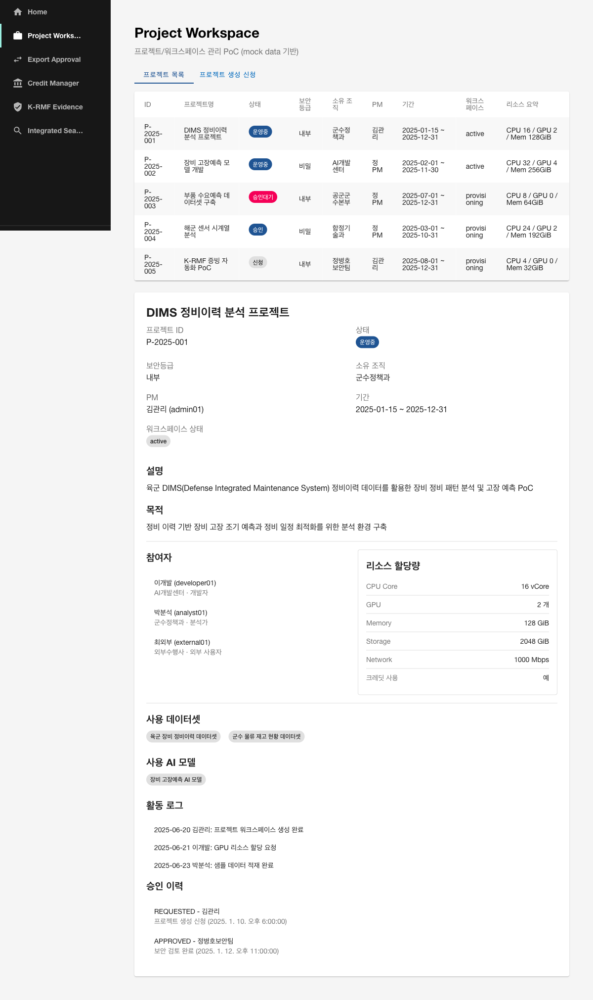
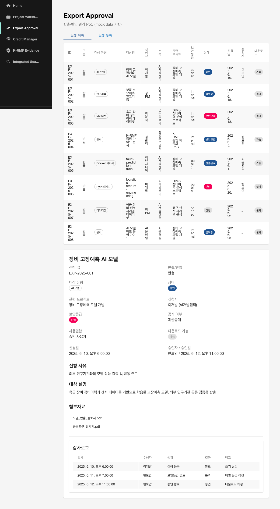
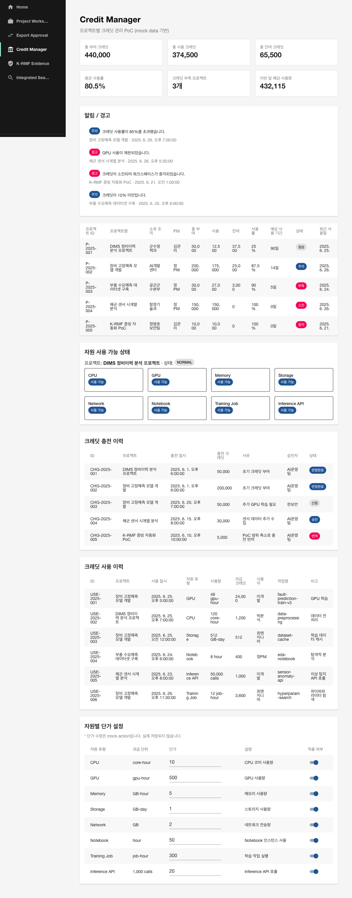
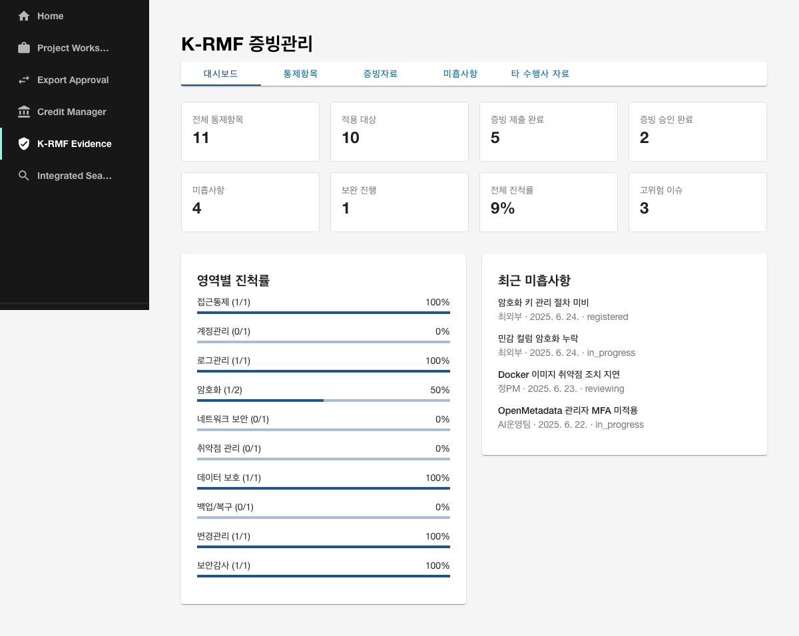
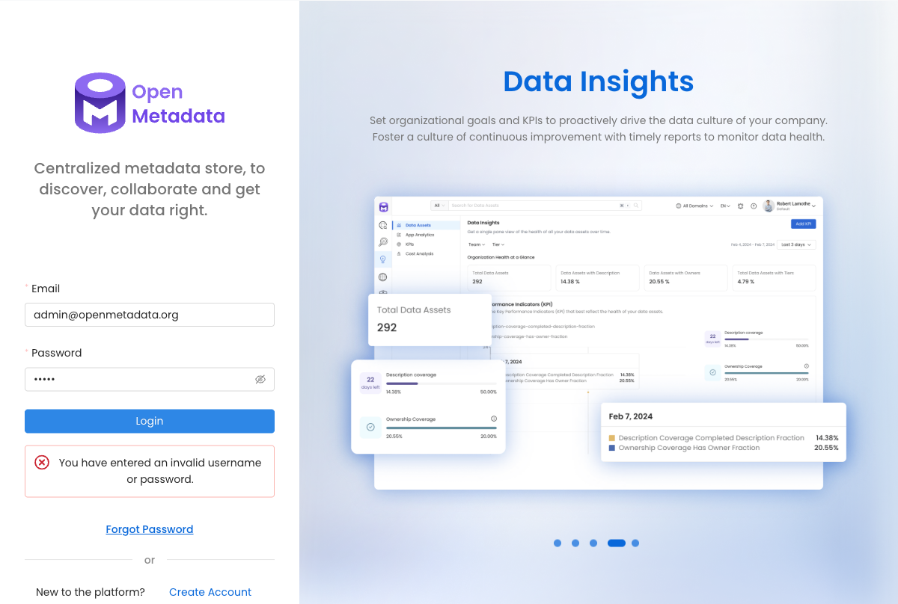
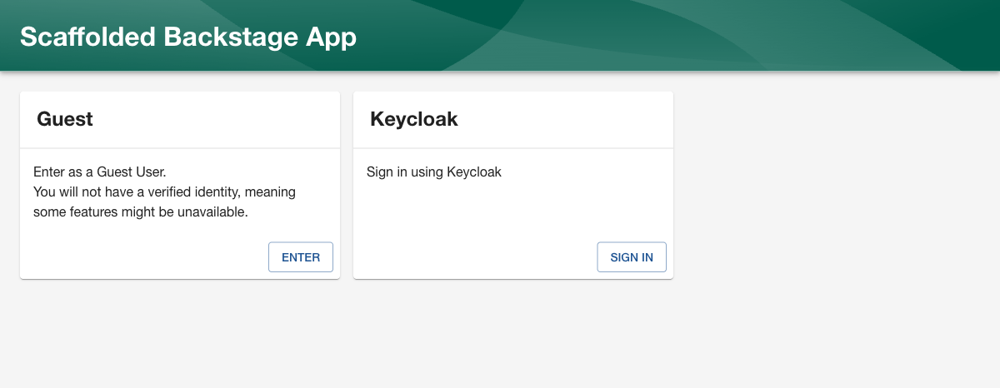
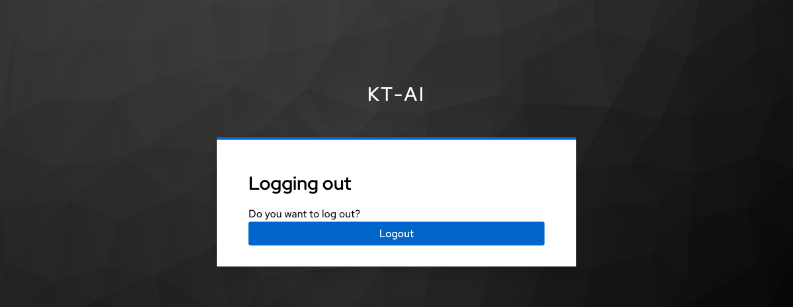

# 국방지능화플랫폼

**K-Defense Intelligence Platform**

국방 AI 데이터 플랫폼 PoC 프로젝트입니다. Backstage 기반 포털에 Keycloak 인증, OpenSearch 통합검색, OpenMetadata 카탈로그, 그리고 AI 데이터 플랫폼 업무 기능(Project Workspace, Export Approval, Credit Manager, K-RMF Evidence, Admin Console)을 통합한 구조입니다.

## 주요 화면

아래는 PoC에서 구현·연동한 주요 화면입니다. (이미지는 모두 본 저장소의 `docs/assets/final/`에 포함되어 있습니다.)

### 1. Portal Dashboard

국방지능화플랫폼 (K-Defense Intelligence Platform) 메인 대시보드입니다. 로그인한 사용자 정보, 통합검색 바로가기, 주요 현황 요약(공지사항, 신규 자산, 내 프로젝트, 반출 승인 대기, 크레딧, K-RMF 증빙 진행률, 시스템 상태)과 업무 메뉴 바로가기를 한눈에 제공합니다.



### 2. Integrated Search

OpenSearch `portal-catalog` 인덱스를 기반으로 데이터셋, AI 모델, Docker 이미지, PyPI 패키지, 문서 등을 한 번에 검색합니다. URL `?q=` 파라미터를 통해 외부에서도 검색어를 전달할 수 있습니다.



### 3. Project Workspace

프로젝트/워크스페이스를 신청·조회·관리하는 화면입니다. 신규 프로젝트 신청과 기존 프로젝트 목록/상세 정보를 PoC 수준에서 제공합니다.



### 4. Export Approval

데이터 반출/반입 승인 프로세스를 관리하는 화면입니다. 신청 목록, 승인 상태, 상세 보기 등의 mock 기반 워크플로우를 보여줍니다.



### 5. Credit Manager

프로젝트별 AI 자원 크레딧 현황을 관리하는 화면입니다. 잔여 크레딧, 사용 내역, 충전/할당 현황을 요약합니다.



### 6. K-RMF Evidence

K-RMF(국방 정볼체계 보안통제) 증빙 관리 화면입니다. 통제 항목별 증빙 진행률과 산출물 목록을 확인할 수 있습니다.



### 7. OpenMetadata Catalog

OpenMetadata 데이터/AI 카탈로그 UI입니다. 데이터베이스, 테이블, ML 모델 등의 메타데이터와 lineage를 탐색합니다.



### 8. OpenSearch Dashboards

OpenSearch Dashboards 화면입니다. `portal-catalog` 인덱스 패턴을 바탕으로 데이터를 검색하고 시각화합니다.


### 9. Backstage OIDC Sign-in

Backstage 로그인 페이지입니다. Keycloak OIDC Provider와 Guest 로그인 옵션을 제공합니다.



### 10. Keycloak Login

Keycloak OIDC 로그인 화면입니다. `admin01` 사용자를 통해 Backstage로 SSO 로그인하는 과정을 보여줍니다.



## 기술 스택

| 영역 | 기술 |
|------|------|
| 포털 프레임워크 | Backstage (React/TypeScript) |
| 인증/권한 | Keycloak (OIDC) |
| 검색엔진 | OpenSearch |
| 데이터/AI 카탈로그 | OpenMetadata |
| 컨테이너 | Docker Compose |
| 개발 환경 | macOS, Node.js 22/24, Yarn |

## 주요 기능

- **Portal Dashboard**: 로그인 사용자 정보, 통합검색, 주요 현황 요약, 공지사항, 신규 자산, 내 프로젝트, 반출 승인 대기, 크레딧, K-RMF 증빙 진행률, 시스템 상태, 주요 메뉴 바로가기
- **Integrated Search**: OpenSearch `portal-catalog` 기반 데이터셋/AI 모델/Docker 이미지/PyPI 패키지/문서 통합 검색
- **Project Workspace**: 프로젝트/워크스페이스 관리 PoC
- **Export Approval**: 데이터 반출/반입 승인 관리 PoC
- **Credit Manager**: 프로젝트별 크레딧 관리 PoC
- **K-RMF Evidence**: K-RMF 보안통제 증빙관리 PoC
- **Admin Console**: 사용자/권한/정책/감사로그/메뉴 관리자 허브 PoC (사용자 등록/승인/외부 사용자 관리 상세화)

## 폴더 구조

```text
kt-ai-portal/
├─ backstage-portal/       # Backstage 앱
│  ├─ packages/app/src/components/
│  │  ├─ portal-dashboard/
│  │  ├─ integrated-search/
│  │  ├─ project-workspace/
│  │  ├─ export-approval/
│  │  ├─ credit-manager/
│  │  └─ krmf-evidence/
│  ├─ scripts/start-dev.sh
│  ├─ .env.example
│  └─ README.md
├─ docs/                   # 문서
│  ├─ FINAL_DELIVERABLES.md
│  ├─ DEMO_SCRIPT.md
│  ├─ TECH_DEBT.md
│  ├─ ARCHITECTURE.md
│  ├─ WBS.md
│  ├─ CHANGE_SUMMARY.md
│  ├─ TODO.md
│  └─ ...
├─ notes/
│  └─ DECISIONS.md
├─ infra/
│  ├─ keycloak/
│  ├─ opensearch/
│  └─ openmetadata/
└─ README.md
```

## 실행 방법

### 1. 사전 요구사항

- macOS
- Docker Desktop
- Node.js 22 또는 24
- Yarn (Corepack 권장)

### 2. 인프라 실행

```bash
cd infra/keycloak
docker compose up -d

cd ../opensearch
docker compose up -d

cd ../openmetadata
docker compose up -d
```

### 3. Backstage 환경변수 설정

```bash
cd backstage-portal
cp .env.example .env
```

`.env` 파일의 `AUTH_OIDC_CLIENT_SECRET`은 Keycloak Admin Console에서 `kt-ai` Realm → `backstage` Client → `Credentials` 탭의 Client Secret으로 설정합니다.

### 4. Backstage 실행

```bash
./scripts/start-dev.sh
```

> `yarn start`만 실행하면 `.env`의 환경변수가 로딩되지 않아 OIDC provider가 skip될 수 있습니다. 반드시 `./scripts/start-dev.sh`를 사용하세요.

## 주요 URL

| 서비스 | URL | 비고 |
|--------|-----|------|
| Backstage | http://localhost:3000 | Keycloak OIDC 로그인 |
| Backstage backend | http://localhost:7007 | - |
| Admin Console | http://localhost:3000/admin-console | 관리자 허브 |
| Keycloak Admin | http://localhost:8080/admin | 관리자 콘솔 |
| OpenSearch Dashboards | http://localhost:5601 | 검색·시각화 |
| OpenMetadata | http://localhost:8585 | 데이터/AI 카탈로그 |

## 테스트 계정 안내

| 서비스 | 계정 | 비고 |
|--------|------|------|
| Backstage (Keycloak) | admin01 / <password> | OIDC 테스트 계정 |
| Keycloak Admin | admin / <password> | 개발용 관리자 |
| OpenSearch Dashboards | admin / <password> | 기본 계정 |
| OpenMetadata | admin@openmetadata.org / <password> | 기본 계정 |

> 실제 비밀번호는 별도로 안내합니다. 운영 환경에서는 테스트 계정 사용을 금지합니다.

## Secret 설정 방법

1. Keycloak Admin Console(`http://localhost:8080/admin`) 접속
2. Realm `kt-ai` 선택 → Client `backstage` 선택
3. `Credentials` 탭에서 Client Secret 복사
4. `backstage-portal/.env`의 `AUTH_OIDC_CLIENT_SECRET`에 붙여넣기
5. `AUTH_SESSION_SECRET`에는 긴 무작위 문자열 설정
6. `./scripts/start-dev.sh`로 Backstage 재시작

## PoC 한계사항

- 업무 기능(Project Workspace, Export Approval, Credit Manager, K-RMF Evidence, Admin Console)은 mock data 기반
- 실제 DB/API 연동 없음
- 실제 파일 반출/다운로드 통제 없음
- 권한 기반 검색 결과 필터링 미구현
- OpenMetadata와 포털 데이터 자동 동기화 미구현
- 정식 Backstage Plugin 구조가 아닌 PoC 컴포넌트 방식
- TypeScript 기존 테스트 오류 일부 존재

자세한 내용은 `docs/FINAL_DELIVERABLES.md` 및 `docs/TECH_DEBT.md` 참조.

## 후속 개발 과제

1. 실제 DB/API 연동
2. Keycloak role/group 기반 권한 제어
3. OpenMetadata ↔ 포털 데이터 동기화
4. OpenSearch 업무 데이터 색인 파이프라인
5. 파일 반출 저장소 연동
6. 크레딧 사용량 수집
7. K-RMF 산출물 패키징
8. 정식 Backstage Plugin 전환
9. TypeScript 오류 정리
10. 운영 배포 구조 설계

## 문서

- `docs/FINAL_DELIVERABLES.md` — 최종 산출물 목록
- `docs/DEMO_SCRIPT.md` — 데모 시나리오 및 발표 멘트
- `docs/TECH_DEBT.md` — 기술 부채 정리
- `docs/ARCHITECTURE.md` — 아키텍처 설명
- `docs/WBS.md` — 작업 분해 구조
- `docs/CHANGE_SUMMARY.md` — 변경 이력
- `docs/TODO.md` — 작업 및 후속 과제
- `notes/DECISIONS.md` — 주요 결정사항

## 참고

- `.env` 파일은 `.gitignore`에 포함되어 Git 추적 대상이 아닙니다.
- 실제 secret 값은 문서와 Git에 기록하지 않습니다.
- 운영 환경으로 전환 시 별도 보안 검토와 구조 설계가 필요합니다.
