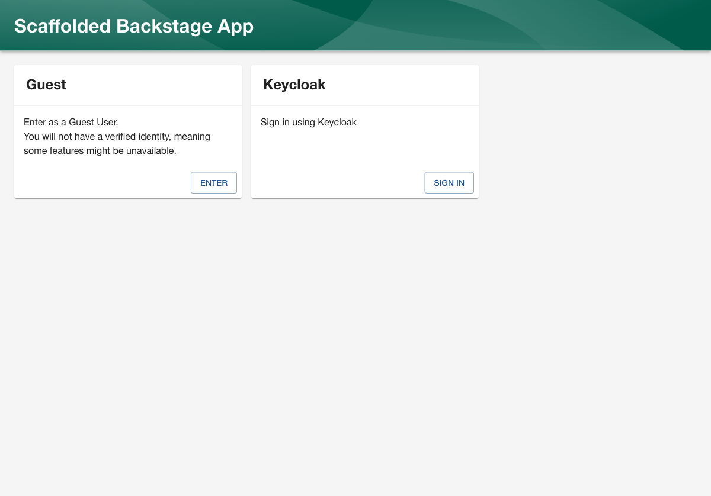
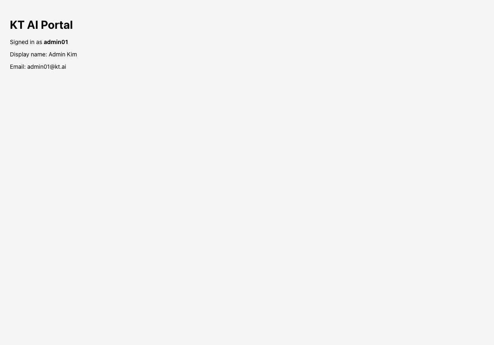

# Backstage ↔ Keycloak OIDC Integration Guide

KT AI/Data Platform Portal PoC의 Backstage 프론트엔드/백엔드와 Keycloak OIDC 인증을 연동한 절차와 검증 결과입니다.

## 개요

- Backstage: `http://localhost:3000`
- Backstage backend: `http://localhost:7007`
- Keycloak: `http://localhost:8080`
- Keycloak realm: `kt-ai`
- Keycloak client: `backstage`
- OIDC metadata: `http://localhost:8080/realms/kt-ai/.well-known/openid-configuration`

## 변경 파일

- `backstage-portal/app-config.yaml`
- `backstage-portal/packages/app/src/App.tsx`
- `backstage-portal/packages/app/src/index.tsx`
- `backstage-portal/packages/backend/src/index.ts`
- `backstage-portal/packages/backend/package.json`
- `backstage-portal/packages/app/package.json`
- `backstage-portal/.env` (gitignore, 로컬 전용)
- `backstage-portal/.env.example`

## 백엔드 설정

### 1. OIDC Provider 모듈 추가

`packages/backend/src/index.ts`:

```ts
backend.add(import('@backstage/plugin-auth-backend'));
backend.add(import('@backstage/plugin-auth-backend-module-guest-provider'));
backend.add(import('@backstage/plugin-auth-backend-module-oidc-provider'));
```

### 2. 의존성

`packages/backend/package.json`:

```json
"@backstage/plugin-auth-backend-module-oidc-provider": "^0.4.17"
```

## 환경 변수

`backstage-portal/.env` (로컬 개발용, `.gitignore` 처리):

```bash
AUTH_OIDC_CLIENT_SECRET=<keycloak-client-secret>
AUTH_SESSION_SECRET=<long-random-string>
```

`.env.example`:

```bash
AUTH_OIDC_CLIENT_SECRET=replace-with-keycloak-client-secret
AUTH_SESSION_SECRET=replace-with-a-long-random-string
```

> `AUTH_SESSION_SECRET`은 OIDC PKCE/state 쿠키를 위한 `express-session` 비밀키입니다. 없으면 `Authentication failed, authentication requires session support` 오류가 발생합니다.

## 앱 설정 (app-config.yaml)

```yaml
auth:
  environment: development
  session:
    secret: ${AUTH_SESSION_SECRET}
  providers:
    guest: {}
    oidc:
      development:
        metadataUrl: http://localhost:8080/realms/kt-ai/.well-known/openid-configuration
        clientId: backstage
        clientSecret: ${AUTH_OIDC_CLIENT_SECRET}
        prompt: auto
        signIn:
          resolvers:
            - resolver: emailLocalPartMatchingUserEntityName
              allowedDomains:
                - kt.ai
              dangerouslyAllowSignInWithoutUserInCatalog: true
```

## 프론트엔드 설정

### 의존성

`packages/app/package.json`:

```json
"@backstage/app-defaults": "^1.7.9"
```

### App.tsx

`@backstage/app-defaults`의 `createApp`을 사용하여 OIDC 로그인 버튼을 노출합니다.

```tsx
import React from 'react';
import { createApp } from '@backstage/app-defaults';
import { AppRouter, OAuth2 } from '@backstage/core-app-api';
import {
  AlertDisplay,
  OAuthRequestDialog,
  SignInPage,
} from '@backstage/core-components';
import {
  createApiFactory,
  configApiRef,
  createApiRef,
  discoveryApiRef,
  oauthRequestApiRef,
  OAuthApi,
  OpenIdConnectApi,
  ProfileInfoApi,
  BackstageIdentityApi,
  SessionApi,
  useApi,
  identityApiRef,
} from '@backstage/core-plugin-api';

export const oidcAuthApiRef = createApiRef<
  OAuthApi &
    OpenIdConnectApi &
    ProfileInfoApi &
    BackstageIdentityApi &
    SessionApi
>({
  id: 'auth.oidc',
});

const oidcProvider = {
  id: 'oidc-auth-provider',
  title: 'Keycloak',
  message: 'Sign in using Keycloak',
  apiRef: oidcAuthApiRef,
};

const app = createApp({
  apis: [
    createApiFactory({
      api: oidcAuthApiRef,
      deps: {
        discoveryApi: discoveryApiRef,
        oauthRequestApi: oauthRequestApiRef,
        configApi: configApiRef,
      },
      factory: ({ discoveryApi, oauthRequestApi }) =>
        OAuth2.create({
          discoveryApi,
          oauthRequestApi,
          provider: { id: 'oidc', title: 'Keycloak', icon: () => null },
          environment: 'development',
          defaultScopes: ['openid', 'profile', 'email'],
        }),
    }),
  ],
  components: {
    SignInPage: props => (
      <SignInPage {...props} providers={['guest', oidcProvider]} />
    ),
  },
});

const Home = () => {
  const identity = useApi(identityApiRef);
  const profile = identity.getProfile();
  return (
    <div style={{ padding: 24 }}>
      <h1>KT AI Portal</h1>
      <p>Signed in as <strong>{identity.getUserId()}</strong></p>
      <p>Display name: {profile.displayName || '(unset)'}</p>
      <p>Email: {profile.email || '(unset)'}</p>
    </div>
  );
};

const App = () => (
  <>
    <AlertDisplay />
    <OAuthRequestDialog />
    <AppRouter>
      <Home />
    </AppRouter>
  </>
);

export default app.createRoot(<App />);
```

### index.tsx

```tsx
import '@backstage/cli/asset-types';
import ReactDOM from 'react-dom/client';
import App from './App';
import '@backstage/ui/css/styles.css';

ReactDOM.createRoot(document.getElementById('root')!).render(<App />);
```

## 실행 방법

```bash
cd kt-ai-portal/backstage-portal
export AUTH_OIDC_CLIENT_SECRET=<keycloak-secret>
export AUTH_SESSION_SECRET=<random-secret>
yarn start
```

또는 `.env` 파일을 작성한 뒤:

```bash
export $(grep -v '^#' .env | xargs)
yarn start
```

## 검증 결과

### 1. Backstage 로그인 페이지

- URL: `http://localhost:3000`
- `Guest`와 `Keycloak` 로그인 버튼이 노출됨
- `Keycloak` 버튼 클릭 시 Keycloak 로그인 페이지로 이동



### 2. Keycloak 로그인

- Redirect URL: `http://localhost:8080/realms/kt-ai/protocol/openid-connect/auth?client_id=backstage&...`
- 테스트 계정 `admin01` / `admin01`로 로그인 성공
- 인증 후 Backstage로 복귀

### 3. Backstage 인증 결과

Backstage UI에서 다음과 같이 Keycloak 사용자 정보가 반영됨:

- User ID: `admin01`
- Display name: `Admin Kim`
- Email: `admin01@kt.ai`



백엔드 로그에서도 다음이 확인됨:

```text
auth info Issuing token for user:default/admin01, with entities user:default/admin01
GET /api/auth/oidc/refresh?optional&scope=openid%20profile%20email&env=development 200
```

## 추가 참고

- `.env` 파일은 `.gitignore`에 포함되어 커밋되지 않습니다.
- Keycloak 사용자 비밀번호는 개발용으로 사용자명과 동일하게 설정되었습니다.
- 그룹/역할 기반 권한 제어는 별도 클라이언트 매퍼 추가 및 Backstage 권한 정책 설계가 필요합니다.

## 다음 단계

- Keycloak client 매퍼를 추가하여 `groups`/`roles` Claim 포함
- Backstage catalog에 User/Group 엔티티 등록 및 권한 정책 설계
- OpenSearch/OpenMetadata 연동

## OIDC 런타임 환경변수 안정화 (11.1단계)

### 문제

`yarn start`만으로는 `.env`의 `AUTH_OIDC_CLIENT_SECRET`, `AUTH_SESSION_SECRET`이 로딩되지 않아 backend가 OIDC provider를 skip할 수 있음.

### 해결

`backstage-portal/scripts/start-dev.sh`를 사용하여 `.env`를 명시적으로 export한 뒤 Backstage를 실행.

```bash
cd kt-ai-portal/backstage-portal
./scripts/start-dev.sh
```

자세한 내용은 `docs/OIDC_RUNTIME_FIX.md` 참조.

### 검증

- backend 로그: `Configuring auth provider: oidc` 확인
- `admin01` Keycloak 로그인 성공
- Portal Dashboard에 `Admin Kim (user:default/admin01)` 표시
