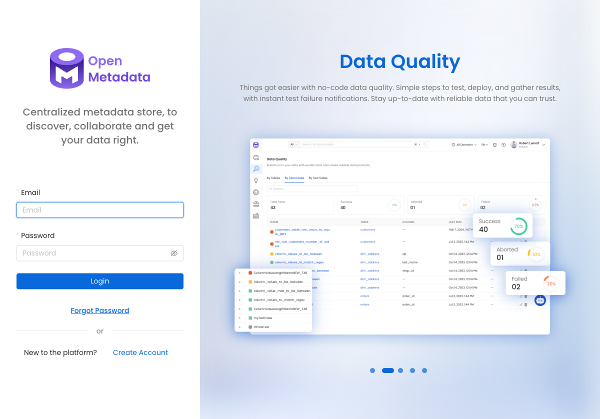

# OpenMetadata 카탈로그 연동 설계

## 개요

본 문서는 KT AI/Data Platform Portal PoC에서 **데이터/AI 카탈로그**로 사용할 OpenMetadata의 개발 환경 구성, UI/API 접근, Backstage 연동 후보를 정의합니다.

- OpenMetadata 버전: **1.6.0**
- 공식 Docker Compose(quickstart) 기반
- 현재 단계에서는 실행 및 설계까지만 진행하며, Backstage와의 직접 연동은 10단계(통합검색/카탈로그 검색 고도화)에서 확장합니다.

## 목표

- OpenMetadata 1.6.0을 Docker Compose로 로컬 개발환경에서 실행
- UI(`http://localhost:8585`) 및 API(`/api/v1`) 접근 검증
- 데이터셋/테이블/AI 모델/파이프라인 메타데이터 개념 문서화
- Backstage와의 연동 후보 API 정리
- 향후 수집/싱크 자동화 방향 제시

## 아키텍처에서의 위치

```text
[User]
  ↓ HTTP
[Backstage Portal]
  ↓ OIDC
[Keycloak]
  ↓ Catalog API / Search API
[OpenMetadata] ←────→ [OpenSearch]
```

- Backstage는 OpenMetadata의 REST API를 통해 카탈로그 상세/계보/품질 정보를 조회합니다.
- OpenSearch는 통합검색 인덱스(`portal-catalog`)를 담당하며, OpenMetadata에서 수집된 핵심 메타데이터를 선택적으로 색인할 수 있습니다.

## 개발 환경 구성

### 파일

- `infra/openmetadata/docker-compose.yml`
- `infra/openmetadata/README.md`

### 노출 포트

| 서비스 | 컨테이너 낮쪽 포트 | 호스트 노출 | 비고 |
|--------|-------------------|------------|------|
| OpenMetadata Server UI/API | `8585` | `8585` | 메인 접속 포트 |
| OpenMetadata Admin/Health | `8586` | `8586` | healthcheck 전용 |
| Elasticsearch | `9200` | 미노출 | `kt-opensearch`(9200)와 충돌 방지 |
| MySQL | `3306` | 미노출 | - |
| Airflow Ingestion | `8080` | 미노출 | `kt-keycloak`(8080)와 충돌 방지 |

### 기본 계정

- ID: `admin@open-metadata.org`
- PW: `admin`

> 첫 로그인 시 비밀번호 변경을 요청할 수 있습니다.

## 실행 방법

```bash
cd infra/openmetadata
docker compose up -d
```

최초 실행 시 `execute_migrate_all` 컨테이너가 DB 마이그레이션을 수행한 후 서버가 시작됩니다.

## 검증

### 1. 서버 healthcheck

```bash
curl http://localhost:8586/healthcheck
# HTTP 200
```

### 2. 버전 정보

```bash
curl http://localhost:8585/api/v1/system/version
```

결과 예시:

```json
{
  "version": "1.6.0",
  "revision": "15e519e8b53065909f6944db097eb87930ee167b",
  "timestamp": 1733821533111
}
```

### 3. 로그인 및 JWT 발급

```bash
curl -X POST http://localhost:8585/api/v1/users/login \
  -H 'Content-Type: application/json' \
  -d '{"email":"admin@open-metadata.org","password":"<password-base64>"}'
```

결과 예시:

```json
{
  "accessToken": "eyJ...",
  "refreshToken": "...",
  "tokenType": "Bearer",
  "expiryDuration": ...
}
```

> 비밀번호는 Base-64 인코딩(`admin` → `YWRtaW4=`) 후 전송합니다.

### 4. API 조회

```bash
TOKEN=<accessToken>

# 등록된 테이블 수
curl -H "Authorization: Bearer $TOKEN" \
  "http://localhost:8585/api/v1/tables?limit=0"

# 등록된 ML 모델 수
curl -H "Authorization: Bearer $TOKEN" \
  "http://localhost:8585/api/v1/mlmodels?limit=0"
```

현재 PoC 초기 상태에서는 테이블/ML 모델 등록 수가 0입니다.

### 5. UI 접속

브라우저에서 `http://localhost:8585`로 접속하면 로그인 페이지로 이동합니다.



## OpenMetadata 핵심 개념

| 개념 | 설명 | KT AI/Data Portal에서의 활용 예 |
|------|------|--------------------------------|
| **DatabaseService / Database / DatabaseSchema / Table** | 외부 데이터베이스 연결 및 테이블 메타데이터 | 육군 정비이력 DB, 데이터마트 테이블 등록 |
| **StorageService / Container** | 객체/파일 스토리지 메타데이터 | S3/MinIO 버킷, 모델 아티팩트 저장소 |
| **DashboardService / Dashboard** | BI 대시보드 메타데이터 | 프로젝트별 모니터링 대시보드 |
| **PipelineService / Pipeline** | ETL/학습 파이프라인 메타데이터 | Airflow DAG, Kubeflow 파이프라인 |
| **MlModelService / MlModel** | AI 모델 메타데이터 | 고장예측 모델, 이미지 분류 모델 |
| **Glossary / GlossaryTerm** | 용어 사전 | 군수 용어, 보안등급, 데이터 품질 기준 |
| **Tag / Classification** | 분류 체계 | `보안등급:공개/내부/비밀`, `소속:육군/해군/공군` |
| **User / Team / Role** | 사용자/팀/권한 | Keycloak 그룹/역할과 매핑 후보 |
| **Data Insight / TestSuite** | 데이터 품질, 계보, 프로파일링 | 품질 점수, 신뢰도 표시 |

## Backstage 연동 후보

### 1. REST API 직접 호출 (권장 1차)

Backstage backend plugin 또는 proxy에서 OpenMetadata API를 호출합니다.

| 목적 | API 예시 |
|------|----------|
| 카탈로그 항목 검색 | `GET /api/v1/search/query?q=정비&index=table_search_index` |
| 테이블 상세 | `GET /api/v1/tables/{id}` |
| ML 모델 상세 | `GET /api/v1/mlmodels/{id}` |
| 계보(Lineage) | `GET /api/v1/lineage/{entityType}/{id}` |
|용어 사전 | `GET /api/v1/glossaries`, `/api/v1/glossaryTerms` |
| 서비스 목록 | `GET /api/v1/services/databaseServices` |

### 2. OpenMetadata Ingestion → OpenSearch 싱크 (권장 2차)

- OpenMetadata 내장 Elasticsearch 인덱스(`table_search_index`, `mlmodel_search_index` 등)를 활용하거나,
- 별도 ingestion 파이프라인으로 OpenMetadata 메타데이터를 `portal-catalog` OpenSearch 인덱스에 동기화합니다.
- Backstage 통합검색 UI는 OpenSearch를 직접 조회합니다.

### 3. OpenMetadata UI 임베드

- iframe 또는 외부 링크로 OpenMetadata 개체 상세 페이지를 Backstage에서 연결합니다.
- 빠른 PoC용이지만 SSO/스타일 통합에 한계가 있습니다.

### 4. SSO 연동 (향후)

- OpenMetadata는 OIDC/SAML/LDAP을 지원합니다.
- Keycloak(`kt-ai` realm)을 OpenMetadata의 OIDC provider로 등록하면 사용자/팀 동기화가 가능합니다.
- 현재 단계에서는 OpenMetadata 기본 로컬 계정을 사용하고, SSO 연동은 운영 확장 단계에서 검토합니다.

## 메타데이터 매핑 예시

| KT AI/Data Portal 개념 | OpenMetadata 개념 | 비고 |
|------------------------|-------------------|------|
| 데이터셋 | Table / Container | DB 테이블 또는 파일 데이터셋 |
| AI 모델 | MlModel | 버전, 알고리즘, 평가지표 기록 |
| 도커 이미지 | Container(Storage) 또는 GlossaryTerm | 아티팩트 메타데이터로 확장 가능 |
| PyPI 패키지 | GlossaryTerm 또는 커스텀 엔티티 | 공통 라이브러리 카탈로깅 |
| 문서 | GlossaryTerm / Tag 활용 문서 | 외부 문서 URL 링크 |
| 프로젝트 | Team | OpenMetadata Team/Organization 매핑 |
| 보안등급 | Classification / Tag | `공개`, `내부`, `비밀` |
| 소스 시스템 | Service(DatabaseService 등) | `군수정보체계`, `AI플랫폼` 등 |

> 보안등급은 `공개`, `내부`, `비밀` 3개 수준으로 통일합니다.

## 다음 단계

1. **OpenMetadata 서비스 등록**
   - MySQL/Postgres/S3 등 PoC 대상 데이터 소스를 DatabaseService/StorageService로 등록
2. **샘플 메타데이터 수집**
   - Ingestion(Airflow) 또는 Python SDK(`metadata`)로 테이블/ML 모델 수집
3. **OpenSearch 싱크**
   - OpenMetadata 메타데이터를 `portal-catalog` 인덱스에 동기화하는 스크립트/파이프라인 작성
4. **Backstage 통합검색 UI**
   - 10단계에서 OpenSearch 기반 검색 화면 개발 및 OpenMetadata 상세 페이지 연결
5. **SSO/권한 통합 (운영 확장)**
   - Keycloak OIDC로 OpenMetadata 로그인 연동
   - Keycloak 그룹/역할과 OpenMetadata Team/Role 매핑

## 결정사항

- OpenMetadata 버전은 **1.6.0**을 사용 (공식 Docker quickstart 기준).
- 기존 PoC 서비스(`kt-keycloak`:8080, `kt-opensearch`:9200)와의 포트 충돌을 피하기 위해 Elasticsearch/MySQL/Ingestion의 호스트 포트 매핑을 제거하고 낮쪽 네트워크에서만 통신하도록 구성.
- OpenMetadata 낮쪽 Elasticsearch는 별도의 `openmetadata_elasticsearch` 컨테이너로 운영하며, `kt-opensearch`와 분리.
- 인증은 OpenMetadata 기본 로컬 계정으로 시작하고, Keycloak SSO는 운영 확장 시 OIDC 연동.
- Backstage와의 직접 연동은 10단계에서 수행; 5단계에서는 API 후보 확보 및 실행 검증에 집중.
