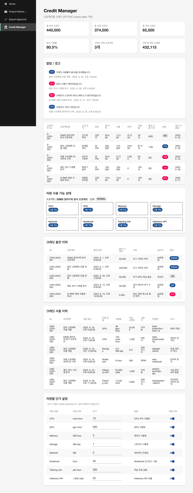

# Credit Manager 플러그인 개요

## 목적

`credit-manager`는 KT AI/Data Platform Portal PoC에서 **프로젝트별 크레딧 관리** 기능을 담당하는 Backstage 자체 플러그인(현재는 PoC 컴포넌트 방식)입니다.

- AI/Data 플랫폼의 자원 사용량을 내부 크레딧 단위로 관리할 수 있는 화면을 제공합니다.
- 실제 과금/결제/큐브 자원 제어 없이 mock data 기반으로 동작하며, 8단계의 목표는 화면과 구조를 검증하는 것입니다.
- 향후 Project Workspace, Keycloak, OpenMetadata, OpenSearch, AI 학습 작업, 클라우드 모니터링 시스템과 연동할 수 있는 확장 구조를 가집니다.

## 구현 방식

- **PoC 컴포넌트 방식**으로 `packages/app/src/components/credit-manager/`에 구현했습니다.
- 6~7단계와 동일한 패턴을 재사용하여 개발 일관성과 안정성을 확보했습니다.
- 정식 Backstage Plugin 전환은 후속 안정화 단계에서 검토합니다.

## 주요 기능

| 기능 | 설명 |
|------|------|
| 프로젝트별 크레딧 현황 | mock data 기반 프로젝트별 총 부여/사용/잔여 크레딧, 사용률, 예상 사용 기간, 상태 표시 |
| 요약 카드 | 전체 총 부여/사용/잔여 크레딧, 평균 사용률, 크레딧 부족 프로젝트 수, 이번 달 예상 사용량 |
| 충전 이력 | 프로젝트별 충전 신청/승인/반려/반영완료 이력 |
| 사용 이력 | 자원 유형(CPU/GPU/Memory/Storage/Network/Notebook/Training Job/Inference API)별 사용 내역 |
| 자원별 단가 | 자원 유형별 과금 단위 및 단가표. 수정은 mock action으로 처리 |
| 자원 사용 가능 상태 | 크레딧 상태(정상/주의/부족/소진/중지)에 따른 자원 제한/허용 표시 |
| 알림/경고 | 사용률 초과, GPU 제한, 크레딧 소진 등 경고 메시지 표시 |

## 화면 구성

### 1. 프로젝트별 크레딧 현황

- 경로: `/credit-manager`
- 상단: 요약 카드 6개
- 알림/경고 패널
- 프로젝트별 크레딧 현황 테이블
  - 프로젝트 ID/명, 소유 조직, PM, 총 부여/사용/잔여 크레딧, 사용률, 예상 사용 기간, 상태, 최근 사용일
- 행 클릭 시 하단에 해당 프로젝트의 자원 사용 가능 상태 표시



### 2. 크레딧 충전/사용 이력

- 충전 이력: ID, 프로젝트, 충전 일시, 크레딧, 사유, 승인자, 상태
- 사용 이력: ID, 프로젝트, 사용 일시, 자원 유형, 사용량, 차감 크레딧, 사용자, 작업명, 비고

### 3. 자원별 단가 설정

- 자원 유형, 과금 단위, 단가, 설명, 적용 여부
- 단가 수정 및 적용 여부 토글은 mock action(콘솔/상태만 반영)

### 4. 자원 사용 가능 상태

- 선택된 프로젝트의 크레딧 상태에 따라 각 자원별 사용 가능/제한 표시
- 제한 사유 및 필요한 추가 크레딧 표시

## 데이터 모델 초안

```ts
// packages/app/src/components/credit-manager/types.ts

export type CreditStatus =
  | 'normal'
  | 'warning'
  | 'low'
  | 'exhausted'
  | 'suspended';

export type ResourceType =
  | 'cpu'
  | 'gpu'
  | 'memory'
  | 'storage'
  | 'network'
  | 'notebook'
  | 'training_job'
  | 'inference_api';

export type ChargeStatus =
  | 'requested'
  | 'approved'
  | 'rejected'
  | 'applied';

export interface ProjectCredit {
  projectId: string;
  projectName: string;
  ownerOrganization: string;
  pm: string;
  totalCredits: number;
  usedCredits: number;
  remainingCredits: number;
  usageRate: number;
  estimatedDays: number;
  status: CreditStatus;
  lastUsedAt: string;
}

export interface ChargeHistory {
  id: string;
  projectName: string;
  chargedAt: string;
  credits: number;
  reason: string;
  approver: string;
  status: ChargeStatus;
}

export interface UsageHistory {
  id: string;
  projectName: string;
  usedAt: string;
  resourceType: ResourceType;
  amount: string;
  deductedCredits: number;
  user: string;
  jobName: string;
  note: string;
}

export interface ResourcePrice {
  resourceType: ResourceType;
  unit: string;
  price: number;
  description: string;
  active: boolean;
}
```

## Mock Data 샘플

### 프로젝트별 크레딧

| 프로젝트 | 총 부여 | 사용 | 잔여 | 사용률 | 상태 |
|----------|---------|------|------|--------|------|
| DIMS 정비이력 분석 | 50,000 | 12,500 | 37,500 | 25% | 정상 |
| 장비 고장예측 모델 개발 | 200,000 | 175,000 | 25,000 | 87.5% | 주의 |
| 부품 수요예측 데이터셋 구축 | 30,000 | 27,000 | 3,000 | 90% | 부족 |
| 해군 센서 시계열 분석 | 150,000 | 150,000 | 0 | 100% | 소진 |
| K-RMF 증빙 자동화 PoC | 10,000 | 10,000 | 0 | 100% | 중지 |

### 자원별 단가

| 자원 유형 | 과금 단위 | 단가 |
|-----------|-----------|------|
| CPU | core-hour | 10 |
| GPU | gpu-hour | 500 |
| Memory | GB-hour | 5 |
| Storage | GB-day | 1 |
| Network | GB | 2 |
| Notebook | hour | 50 |
| Training Job | job-hour | 300 |
| Inference API | 1,000 calls | 20 |

## 파일 구조

```text
packages/app/src/components/credit-manager/
├── index.ts
├── types.ts
├── mockCredits.ts
├── CreditManagerPage.tsx
├── ProjectCreditSummary.tsx
├── CreditBalanceCards.tsx
├── CreditChargeHistory.tsx
├── CreditUsageHistory.tsx
├── ResourcePriceTable.tsx
├── ResourceAvailabilityPanel.tsx
├── CreditAlertPanel.tsx
└── CreditStatusChip.tsx
```

## 메뉴 연결

`packages/app/src/App.tsx`의 `SidebarPage` 납쪽 메뉴에 `Credit Manager` 항목을 추가했습니다.

```tsx
<SidebarItem
  icon={AccountBalanceIcon}
  to="/credit-manager"
  text="Credit Manager"
/>
```

## 후속 API/DB/큐브 사용량 연동 방향

| 연동 대상 | 내용 |
|-----------|------|
| Project Workspace | 프로젝트별 크레딧 현황 연계 |
| Keycloak | 사용자/그룹과 크레딧 신청/승인자 연동 |
| OpenSearch | 프로젝트/자원/사용 이력 통합검색 연계 |
| OpenMetadata | 데이터셋/모델 사용량과 크레딧 차감 연계 |
| AI 학습 작업 | Training Job, Notebook, Inference API 사용량 수집 및 차감 |
| 클라우드 모니터링 | 실제 CPU/GPU/Storage/Network 사용량 연계 |
| 자원 제한 시스템 | 크레딧 부족 시 프로젝트 워크스페이스 자원 생성 제한 |

## 실행 및 검증

### 실행 방법

Backstage가 이미 실행 중이라면 파일 저장 후 자동 핫 리로드됩니다.

```bash
cd kt-ai-portal/backstage-portal
yarn start
```

### 검증 방법

1. `http://localhost:3000` 접속
2. Keycloak 로그인 또는 Guest 로그인
3. 좌측 메뉴 `Credit Manager` 클릭
4. 요약 카드, 알림 패널, 프로젝트별 현황, 자원 사용 가능 상태, 충전/사용 이력, 단가표 확인
5. 행 클릭 시 선택된 프로젝트의 자원 제한 상태가 갱신되는지 확인

## 발생 오류 및 조치

| 오류 | 원인 | 조치 |
|------|------|------|
| MUI v4 `findDOMNode is deprecated` 경고 | Material-UI v4 ListItem/Switch + React Strict Mode 호환성 경고 | 기능에 영향 없음. 운영 확장 시 MUI/Backstage UI 최신 버전 마이그레이션 검토 |
| `validateDOMNesting` 경고: Chip이 `<p>` 내부에 있음 | `ResourceAvailabilityPanel`의 `Typography paragraph` 안에 `Chip` 사용 | `component="div"`로 변경하여 해결 |

## 미완료/보류 사항

- 실제 DB/API 연동
- 실제 과금/결제 처리
- Keycloak 사용자/그룹 연동
- OpenMetadata/OpenSearch 연계
- AI 학습 작업/Notebook/Inference API 사용량 수집
- 클라우드 모니터링 시스템 연계
- 크레딧 부족 시 실제 자원 제한
- 정식 Backstage Plugin 구조 전환
