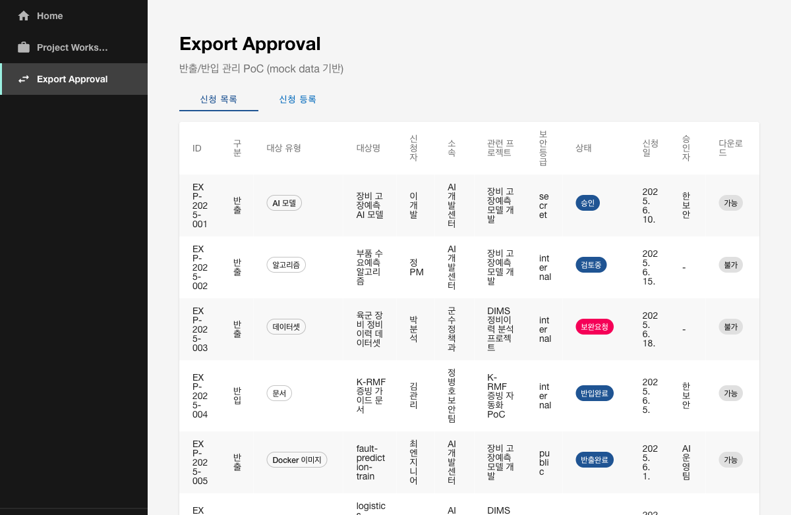
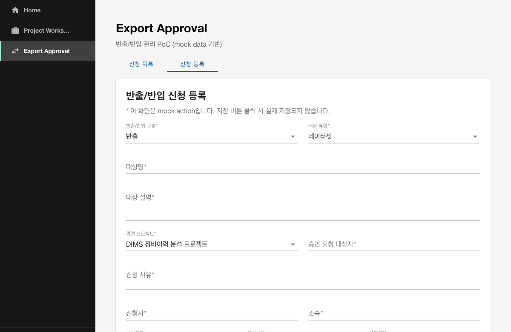

# Export Approval 플러그인 개요

## 목적

`export-approval`은 KT AI/Data Platform Portal PoC에서 **반출/반입 관리** 기능을 담당하는 Backstage 자체 플러그인(현재는 PoC 컴포넌트 방식)입니다.

- AI 모델, 데이터셋, 문서, Docker 이미지, PyPI 패키지, 알고리즘, 서버 등 다양한 자산의 반출/반입 신청을 관리합니다.
- 실제 DB/API/파일 다운로드 연동 없이 mock data 기반으로 화면과 구조를 검증합니다.
- 향후 Project Workspace, Keycloak, OpenMetadata, OpenSearch, K-RMF 증빙관리와 연계할 수 있는 확장 구조를 가집니다.

## 구현 방식

- **PoC 컴포넌트 방식**으로 `packages/app/src/components/export-approval/`에 구현했습니다.
- 6단계 `project-workspace`와 동일한 방식이며, 정식 Backstage Plugin 전환은 후속 안정화 단계에서 검토합니다.
- 이유: 기존 OIDC 로그인 흐름과 `Project Workspace` 화면을 최소 수정으로 유지하면서 신규 메뉴/화면을 추가하기 위함입니다.

## 주요 기능

| 기능 | 설명 |
|------|------|
| 반출/반입 신청 목록 | mock data 기반 신청 목록을 테이블로 표시 |
| 신청 상세 | 선택한 신청의 기본 정보, 보안 설정, 승인 흐름, 첨부자료, 감사로그 표시 |
| 신청 등록 | 신규 반출/반입 신청 입력 폼. 현재는 mock action으로 입력값 확인 |
| 대상 유형 표시 | `서버`, `AI 모델`, `알고리즘`, `데이터셋`, `문서`, `Docker 이미지`, `PyPI 패키지` Chip 표시 |
| 승인 상태 표시 | `신청`, `검토중`, `보완요청`, `승인`, `반려`, `반출완료`, `반입완료` Chip 표시 |
| 보안/공개/권한 표시 | 보안등급, 공개 여부, 사용권한 표시 |
| 다운로드 가능 여부 | `가능`/`불가` Chip 표시 |
| 감사로그 | 건당 활동 이력(신청, 검토, 승인 등) 표시 |

## 화면 구성

### 1. 신청 목록 화면

- 경로: `/export-approval`
- 상단: 탭(`신청 목록`, `신청 등록`)
- 목록: ID, 구분, 대상 유형, 대상명, 신청자, 소속, 관련 프로젝트, 보안등급, 상태, 신청일, 승인자, 다운로드 가능 여부
- 행 클릭 시 하단에 상세 정보 표시



### 2. 신청 상세 화면

- 하단 패널에 표시
- 기본 정보(구분, 대상 유형, 상태, 프로젝트, 신청자, 보안등급, 공개 여부, 사용권한, 다운로드 가능 여부, 신청일, 승인자/승인일)
- 신청 사유, 대상 설명
- 보완요청 내용(해당 시)
- 첨부자료 목록
- 감사로그

### 3. 신청 등록 화면

- 탭: `신청 등록`
- 입력 항목:
  - 반출/반입 구분
  - 대상 유형
  - 대상명, 대상 설명
  - 관련 프로젝트
  - 승인 요청 대상자
  - 신청 사유
  - 신청자, 소속
  - 보안등급, 공개 여부, 사용권한
  - 첨부자료명
  - 다운로드 필요 여부
- 저장 버튼 클릭 시 mock alert 발생



## 데이터 모델 초안

```ts
// packages/app/src/components/export-approval/types.ts

export type ExportDirection = 'export' | 'import';

export type ExportTargetType =
  | 'server'
  | 'ai_model'
  | 'algorithm'
  | 'dataset'
  | 'document'
  | 'docker_image'
  | 'pypi_package';

export type ExportStatus =
  | 'requested'
  | 'reviewing'
  | 'need_revision'
  | 'approved'
  | 'rejected'
  | 'export_completed'
  | 'import_completed';

export type SecurityLevel = 'public' | 'internal' | 'secret';

export type Visibility = 'public' | 'private' | 'restricted';

export type AccessScope =
  | 'all_users'
  | 'project_members'
  | 'approved_users'
  | 'admins_only';

export interface AuditLogEntry {
  timestamp: string;
  actor: string;
  action: string;
  result: string;
  note: string;
}

export interface ExportRequest {
  id: string;
  direction: ExportDirection;
  targetType: ExportTargetType;
  targetName: string;
  targetDescription: string;
  projectId: string;
  projectName: string;
  reason: string;
  requester: string;
  requesterOrg: string;
  securityLevel: SecurityLevel;
  visibility: Visibility;
  accessScope: AccessScope;
  status: ExportStatus;
  requestedAt: string;
  approver?: string;
  approvedAt?: string;
  downloadable: boolean;
  attachments: string[];
  revisionNote?: string;
  auditLog: AuditLogEntry[];
}
```

## Mock Data 샘플

총 8건의 샘플 신청 데이터가 포함되어 있습니다.

| ID | 구분 | 대상 유형 | 대상명 | 상태 |
|----|------|----------|--------|------|
| EXP-2025-001 | 반출 | AI 모델 | 장비 고장예측 AI 모델 | approved |
| EXP-2025-002 | 반출 | 알고리즘 | 부품 수요예측 알고리즘 | reviewing |
| EXP-2025-003 | 반출 | 데이터셋 | 육군 장비 정비이력 데이터셋 | need_revision |
| EXP-2025-004 | 반입 | 문서 | K-RMF 증빙 가이드 문서 | import_completed |
| EXP-2025-005 | 반출 | Docker 이미지 | fault-prediction-train | export_completed |
| EXP-2025-006 | 반출 | PyPI 패키지 | logistics-feature-engineering | rejected |
| EXP-2025-007 | 반출 | 데이터셋 | 해군 장비 센서 시계열 데이터셋 | requested |
| EXP-2025-008 | 반출 | 문서 | AI 모델 배포 운영 가이드 | reviewing |

## 파일 구조

```text
packages/app/src/components/export-approval/
├── index.ts
├── types.ts
├── mockExportRequests.ts
├── ExportApprovalPage.tsx
├── ExportRequestList.tsx
├── ExportRequestDetail.tsx
├── ExportRequestForm.tsx
├── ExportStatusChip.tsx
├── ExportTargetTypeChip.tsx
├── SecurityLevelChip.tsx
└── AuditLogPanel.tsx
```

## 메뉴 연결

`packages/app/src/App.tsx`의 `SidebarPage` 납쪽 메뉴에 `Export Approval` 항목을 추가했습니다.

```tsx
<SidebarItem
  icon={SwapHorizIcon}
  to="/export-approval"
  text="Export Approval"
/>
```

## 후속 API/DB/파일저장소 연동 방향

| 연동 대상 | 내용 |
|-----------|------|
| Project Workspace | 프로젝트별 반출/반입 신청 조회 및 연계 |
| Keycloak | 신청자/승인자 사용자 및 그룹 연동 |
| OpenMetadata | 반출 대상 데이터셋/AI 모델과 OpenMetadata 자산 연결 |
| OpenSearch | 통합검색에서 반출 대상 및 신청 이력 검색 연계 |
| K-RMF 증빙관리(9단계) | 반출승인 이력 및 보안통제 증빙 연계 |
| 반출 서버/파일 저장소 | 실제 파일 다운로드/업로드 통제 및 감사로그 저장 |
| Backend API/DB | 신청 CRUD, 승인 workflow, 다운로드 권한 관리 API 개발 |

## 실행 및 검증

### 실행 방법

Backstage가 이미 실행 중이라면 파일 저장 후 자동 핫 리로드됩니다.

```bash
cd kt-ai-portal/backstage-portal
yarn start
```

### 검증 방법

1. `http://localhost:3000` 접속
2. Keycloak 로그인 또는 Guest 로그인
3. 좌측 메뉴 `Export Approval` 클릭
4. 반출/반입 신청 목록 및 상세 정보 확인
5. `신청 등록` 탭에서 폼 확인 및 mock 저장 버튼 클릭

## 발생 오류 및 조치

| 오류 | 원인 | 조치 |
|------|------|------|
| MUI v4 Tabs `findDOMNode is deprecated` 경고 | Material-UI v4 Tabs + React Strict Mode 호환성 경고 | 기능에 영향 없음. 운영 확장 시 MUI/Backstage UI 최신 버전 마이그레이션 검토 |

## 미완료/보류 사항

- 실제 DB/API 연동
- 실제 파일 업로드/다운로드 기능
- Keycloak 사용자/그룹과 신청자/승인자 연동
- OpenMetadata 자산 연동
- OpenSearch 검색 연계
- K-RMF 증빙관리 연계
- 정식 Backstage Plugin 구조 전환
