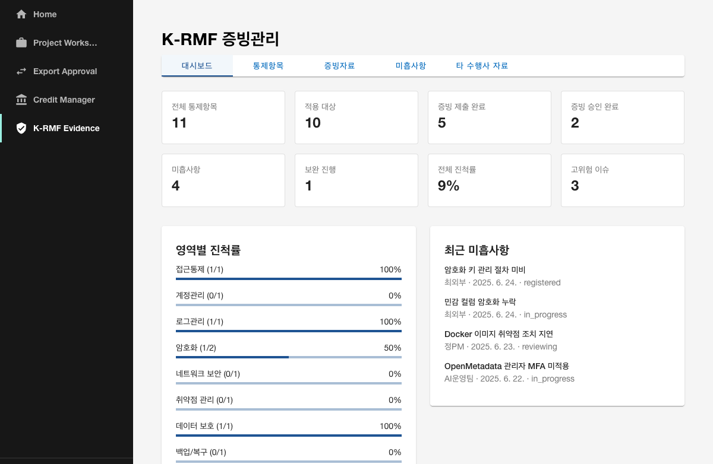

# K-RMF 증빙관리 플러그인 개요

## 목적

`krmf-evidence`는 KT AI/Data Platform Portal PoC에서 **K-RMF(Korea Risk Management Framework) 통제항목 및 증빙자료 관리** 기능을 담당하는 Backstage 자체 플러그인(현재는 PoC 컴포넌트 방식)입니다.

- AI/Data 플랫폼 운영에 필요한 보안 통제항목을 체계적으로 관리할 수 있는 화면을 제공합니다.
- 통제항목별 증빙자료 제출/검토/승인 상태, 보안 미흡사항 조치, 타 수행사 제출자료를 한 화면에서 확인합니다.
- 실제 DB/API 연동 없이 mock data 기반으로 동작하며, 9단계의 목표는 화면과 구조를 검증하는 것입니다.
- 향후 Project Workspace, Export Approval, 파일 저장소, 감사 시스템과 연동할 수 있는 확장 구조를 가집니다.

## 구현 방식

- **PoC 컴포넌트 방식**으로 `packages/app/src/components/krmf-evidence/`에 구현했습니다.
- 6~8단계와 동일한 패턴을 재사용하여 개발 일관성과 안정성을 확보했습니다.
- 정식 Backstage Plugin 전환은 후속 안정화 단계에서 검토합니다.

## 주요 기능

| 기능 | 설명 |
|------|------|
| 통합진척률 대시보드 | 전체 통제항목 수, 적용 대상, 증빙 제출/승인 현황, 미흡사항, 보완 진행, 고위험 이슈, 영역별 진척률 요약 |
| 통제항목 관리 | 10개 이상의 K-RMF 통제항목을 통제영역별로 목록화하고 적용 여부, 담당자, 점검 상태, 증빙/미흡 건수 표시 |
| 통제항목 상세 | 통제 목적, 설명, 구현 현황, 적용 대상 시스템, 관련 프로젝트, 관련 반출/반입 승인 이력, 점검 이력 표시 |
| 증빙자료 관리 | 증빙자료의 제출자, 제출일, 검토자, 상태, 파일명, 버전, 비고를 검색/필터로 확인 |
| 보안 미흡사항 조치관리 | 미흡사항의 위험도, 발견일, 담당자, 조치기한, 조치 상태, 조치내용, 잔여위험 관리 |
| 타 수행사 제출자료 관리 | 수행사별 제출 증빙의 검토 상태, 보완요청 여부, 검토결과, 비고 관리 |

## 화면 구성

### 1. 대시보드

- 경로: `/krmf-evidence`
- 상단: 요약 카드 8개(전체 통제항목, 적용 대상, 증빙 제출 완료, 증빙 승인 완료, 미흡사항, 보완 진행, 전체 진척률, 고위험 이슈)
- 좌측: 통제영역별 진척률(LinearProgress)
- 우측: 최근 미흡사항



### 2. 통제항목

- 통제항목 목록 테이블
  - ID, 통제영역, 통제항목명, 적용 여부, 담당자/조직, 중요도, 점검 상태, 증빙/미흡 건수, 최종 점검일
  - 통제영역/점검 상태/검색 필터
- 행 클릭 시 우측 패널에 상세 정보 표시

### 3. 증빙자료

- 증빙자료 목록 테이블
  - ID, 통제항목, 증빙명, 유형, 제출자, 제출일, 검토자, 상태, 파일, 버전
  - 상태/유형/검색 필터

### 4. 보안 미흡사항

- 미흡사항 목록 테이블
  - ID, 통제항목, 미흡사항, 위험도, 발견일, 담당자, 조치기한, 상태, 조치내용, 잔여위험
  - 위험도/조치 상태/검색 필터

### 5. 타 수행사 자료

- 타 수행사 제출자료 목록 테이블
  - ID, 수행사, 증빙명, 통제항목, 제출일, 검토자, 상태, 보완요청, 검토결과, 비고
  - 검토 상태/검색 필터

## 데이터 모델 초안

```ts
// packages/app/src/components/krmf-evidence/types.ts

export type ControlCheckStatus =
  | 'not_checked'
  | 'preparing'
  | 'checking'
  | 'compliant'
  | 'non_compliant'
  | 'remediating'
  | 'completed';

export type EvidenceStatus =
  | 'not_submitted'
  | 'submitted'
  | 'reviewing'
  | 'revision_requested'
  | 'approved'
  | 'rejected';

export type RiskSeverity = 'low' | 'medium' | 'high' | 'critical';

export type IssueStatus =
  | 'registered'
  | 'in_progress'
  | 'resolved'
  | 'reviewing'
  | 'closed'
  | 'deferred';

export type ControlArea =
  | 'access_control'
  | 'account_management'
  | 'log_management'
  | 'encryption'
  | 'network_security'
  | 'vulnerability_management'
  | 'data_protection'
  | 'backup_recovery'
  | 'change_management'
  | 'security_audit';

export type EvidenceType =
  | 'policy_document'
  | 'config_capture'
  | 'log_file'
  | 'scan_report'
  | 'approval_history'
  | 'training_material'
  | 'architecture_doc'
  | 'operational_procedure';

export interface ControlItem {
  id: string;
  area: ControlArea;
  name: string;
  description: string;
  applied: boolean;
  owner: string;
  ownerOrg: string;
  importance: 'low' | 'medium' | 'high';
  checkStatus: ControlCheckStatus;
  evidenceCount: number;
  issueCount: number;
  lastCheckedAt?: string;
  purpose: string;
  targetSystems: string[];
  relatedProjects: string[];
  implementationStatus: string;
  relatedExportRequestIds?: string[];
  auditLog: string[];
}

export interface Evidence {
  id: string;
  controlItemId: string;
  name: string;
  type: EvidenceType;
  submitter: string;
  submittedAt: string;
  reviewer?: string;
  status: EvidenceStatus;
  filename: string;
  version: string;
  note?: string;
}

export interface RiskIssue {
  id: string;
  controlItemId: string;
  title: string;
  severity: RiskSeverity;
  foundAt: string;
  owner: string;
  dueDate: string;
  status: IssueStatus;
  actionContent?: string;
  residualRisk?: string;
}

export interface ExternalSubmission {
  id: string;
  vendorName: string;
  evidenceName: string;
  controlItemId: string;
  submittedAt: string;
  status: EvidenceStatus;
  reviewer?: string;
  reviewResult?: string;
  revisionRequested: boolean;
  note?: string;
}
```

## 상태/Chip 정의

### ControlCheckStatus

| 상태 | 한글 | 의미 |
|------|------|------|
| not_checked | 미점검 | 아직 점검되지 않음 |
| preparing | 준비중 | 증빙 준비 중 |
| checking | 점검중 | 점검 진행 중 |
| compliant | 적합 | 통제 요건 충족 |
| non_compliant | 미흡 | 요건 미흡 |
| remediating | 보완중 | 보완 조치 진행 중 |
| completed | 완료 | 최종 완료 |

### EvidenceStatus

| 상태 | 한글 |
|------|------|
| not_submitted | 미제출 |
| submitted | 제출완료 |
| reviewing | 검토중 |
| revision_requested | 보완요청 |
| approved | 승인 |
| rejected | 반려 |

## 파일 구성

```text
packages/app/src/components/krmf-evidence/
├── index.ts
├── types.ts
├── mockKrmfEvidence.ts
├── KrmfEvidencePage.tsx
├── KrmfDashboard.tsx
├── ProgressSummaryCards.tsx
├── ControlItemList.tsx
├── ControlItemDetail.tsx
├── ControlStatusChip.tsx
├── EvidenceList.tsx
├── EvidenceStatusChip.tsx
├── RiskIssueList.tsx
├── IssueStatusChip.tsx
├── RiskSeverityChip.tsx
└── ExternalSubmissionList.tsx
```

## 실행 방법

Backstage가 실행 중이면 자동 핫 리로드됩니다.

```bash
cd kt-ai-portal/backstage-portal
yarn start
```

## 검증 방법

1. `http://localhost:3000` 접속
2. Keycloak 로그인 또는 Guest 로그인
3. 좌측 메뉴 `K-RMF Evidence` 클릭
4. 대시보드 요약 카드 및 영역별 진척률 확인
5. `통제항목` 탭에서 목록 및 상세 정보 확인
6. `증빙자료` 탭에서 제출/검토/승인 상태 확인
7. `미흡사항` 탭에서 위험도 및 조치 상태 확인
8. `타 수행사 자료` 탭에서 수행사별 제출/검토 상태 확인
9. `Project Workspace`, `Export Approval`, `Credit Manager` 메뉴 및 기존 화면이 정상 동작하는지 확인

## 확인 결과

- Backstage `http://localhost:3000` 정상 접속
- Keycloak `admin01` 사용자 로그인 상태 유지
- `K-RMF Evidence` 메뉴 노출 및 `/krmf-evidence` 이동 확인
- 대시보드 요약 카드 8개 및 영역별 진척률 정상 표시
- 통제항목 11건 목록 및 상세 정보 표시
- 증빙자료 5건, 보안 미흡사항 4건, 타 수행사 제출자료 5건 표시
- `Project Workspace`, `Export Approval`, `Credit Manager` 화면 정상 동작
- OpenSearch `http://localhost:9200` 응답 200 유지
- OpenMetadata `http://localhost:8585/api/v1/system/version` 응답 200 유지

## 발생 오류 및 조치

- MUI v4 `findDOMNode is deprecated` 경고 발생
  - 기능에 영향 없음. 운영 확장 시 MUI/Backstage UI 최신 버전 마이그레이션 검토

## 미완료/보류 사항

- 실제 DB/API 연동
- 파일 업로드/다운로드 및 파일 저장소 연계
- Project Workspace, Export Approval과의 실제 데이터 연동
- 감사 시스템 및 이력 자동 수집
- Keycloak 사용자/그룹 기반 권한 제어
- 정식 Backstage Plugin 구조 전환
