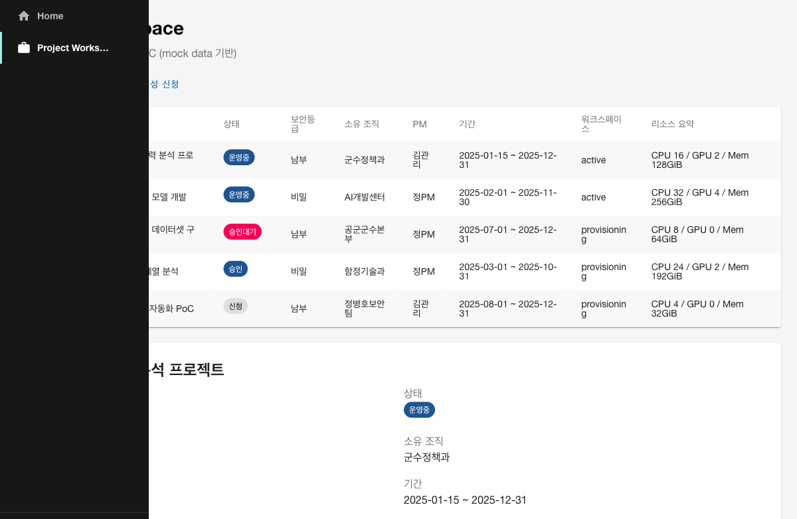
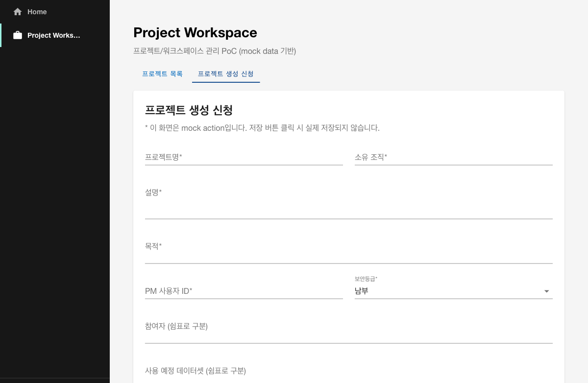

# Project Workspace 플러그인 개요

## 목적

`project-workspace`는 KT AI/Data Platform Portal PoC에서 **프로젝트/워크스페이스 관리** 기능을 담당하는 Backstage 자체 플러그인(현재는 PoC 컴포넌트 방식)입니다.

- 프로젝트 단위로 데이터/AI 자원과 참여자를 관리할 수 있는 화면을 제공합니다.
- 실제 DB/API 연동 없이 mock data 기반으로 동작하며, 6단계의 목표는 화면과 구조를 검증하는 것입니다.
- 향후 Keycloak 사용자/그룹, OpenMetadata 데이터셋, 크레딧/반출관리 플러그인과 연동할 수 있는 확장 구조를 가집니다.

## 구현 방식

- **PoC 컴포넌트 방식**으로 `packages/app/src/components/project-workspace/`에 구현했습니다.
- 정식 Backstage Plugin(`plugins/project-workspace`)으로의 전환은 6단계 이후 안정화/확장 단계에서 검토합니다.
- 이유: 현재 Backstage 1.38 앱은 `createApp` legacy 방식으로 단순화되어 있어, 정식 플러그인 등록 과정에서 기존 OIDC 로그인 흐름을 해칠 위험이 있습니다. PoC 컴포넌트 방식이 최소 수정으로 안전하게 메뉴와 화면을 추가할 수 있습니다.

## 주요 기능

| 기능 | 설명 |
|------|------|
| 프로젝트 목록 | mock data 기반 프로젝트 목록을 테이블로 표시 |
| 프로젝트 상세 | 선택한 프로젝트의 기본 정보, 참여자, 리소스, 데이터셋, 모델, 활동 로그, 승인 이력 표시 |
| 프로젝트 생성 신청 | 신규 프로젝트 등록 UI. 현재는 mock action으로 입력값을 콘솔/alert에 표시 |
| 승인/반려 상태 | `ProjectStatusChip`으로 상태를 시각화 |
| 참여자/역할 | 프로젝트 멤버와 역할(PM, Developer, Analyst 등) 표시 |
| 리소스 할당량 | `ResourceQuotaCard`로 CPU/GPU/Memory/Storage/Network/크레딧 사용 여부 표시 |
| 워크스페이스 상태 | `provisioning`, `active`, `suspended` 등 상태 표시 |

## 화면 구성

### 1. 프로젝트 목록 화면

- 경로: `/project-workspace`
- 상단: 탭(`프로젝트 목록`, `프로젝트 생성 신청`)
- 목록: ID, 프로젝트명, 상태(Chip), 보안등급, 소유 조직, PM, 기간, 워크스페이스 상태, 리소스 요약
- 행 클릭 시 하단에 상세 정보 표시



### 2. 프로젝트 상세 화면

- 하단 패널에 표시
- 기본 정보, 설명, 목적
- 참여자 목록 및 역할
- 리소스 할당량 카드
- 사용 데이터셋/AI 모델
- 활동 로그
- 승인 이력

### 3. 프로젝트 생성 신청 화면

- 탭: `프로젝트 생성 신청`
- 입력 항목:
  - 프로젝트명, 설명, 목적
  - 소유 조직, PM
  - 참여자
  - 보안등급(공개/내부/비밀)
  - 사용 예정 데이터셋
  - 필요 리소스(CPU/GPU/Memory/Storage)
  - 시작일, 종료예정일
- 저장 버튼 클릭 시 mock alert 발생



## 데이터 모델 초안

```ts
// packages/app/src/components/project-workspace/types.ts

export type ProjectStatus =
  | 'requested'
  | 'pending_approval'
  | 'approved'
  | 'rejected'
  | 'running'
  | 'paused'
  | 'closed';

export type ProjectRole =
  | 'PM'
  | 'Developer'
  | 'Analyst'
  | 'DataManager'
  | 'SecurityReviewer'
  | 'ExternalUser';

export type WorkspaceStatus =
  | 'provisioning'
  | 'active'
  | 'suspended'
  | 'terminating'
  | 'terminated';

export type SecurityLevel = '공개' | '내부' | '비밀';

export interface ResourceQuota {
  cpuCores: number;
  gpuCount: number;
  memoryGiB: number;
  storageGiB: number;
  networkMbps: number;
  usesCredit: boolean;
}

export interface ProjectMember {
  userId: string;
  name: string;
  organization: string;
  role: ProjectRole;
}

export interface Project {
  id: string;
  name: string;
  description: string;
  purpose: string;
  status: ProjectStatus;
  securityLevel: SecurityLevel;
  ownerOrganization: string;
  pm: ProjectMember;
  members: ProjectMember[];
  startDate: string;
  endDate: string;
  workspaceStatus: WorkspaceStatus;
  quota: ResourceQuota;
  datasets: string[];
  models: string[];
  activityLog: string[];
  approvalHistory: ApprovalHistory[];
}
```

## Mock Data 샘플

총 5건의 샘플 프로젝트가 포함되어 있습니다.

| ID | 프로젝트명 | 상태 | 보안등급 |
|----|-----------|------|---------|
| P-2025-001 | DIMS 정비이력 분석 프로젝트 | running | 내부 |
| P-2025-002 | 장비 고장예측 모델 개발 | running | 비밀 |
| P-2025-003 | 부품 수요예측 데이터셋 구축 | pending_approval | 내부 |
| P-2025-004 | 해군 센서 시계열 분석 | approved | 비밀 |
| P-2025-005 | K-RMF 증빙 자동화 PoC | requested | 내부 |

## 파일 구조

```text
packages/app/src/components/project-workspace/
├── index.ts
├── types.ts
├── mockProjects.ts
├── ProjectWorkspacePage.tsx
├── ProjectList.tsx
├── ProjectDetail.tsx
├── ProjectRequestForm.tsx
├── ProjectStatusChip.tsx
└── ResourceQuotaCard.tsx
```

## 메뉴 연결

`packages/app/src/App.tsx`에 `SidebarPage` + `Content` 레이아웃을 추가하고, 좌측 메뉴에 `Project Workspace` 항목을 추가했습니다.

```tsx
<SidebarPage>
  <Sidebar>
    <SidebarGroup label="Menu" icon={<HomeIcon />}>
      <SidebarItem icon={HomeIcon} to="/" text="Home" />
      <SidebarItem icon={WorkIcon} to="/project-workspace" text="Project Workspace" />
    </SidebarGroup>
  </Sidebar>
  <Content>
    <Outlet />
  </Content>
</SidebarPage>
```

## 후속 API/DB 연동 방향

| 연동 대상 | 내용 |
|-----------|------|
| Keycloak | 사용자/그룹과 프로젝트 멤버 연계, SSO 세션 기반 PM/역할 자동 매핑 |
| OpenMetadata | 프로젝트 사용 데이터셋/ML 모델을 OpenMetadata Table/MlModel과 연결 |
| 크레딧 관리(8단계) | `ResourceQuota.usesCredit` 및 실제 사용량 연동 |
| 반출관리(7단계) | 프로젝트별 성과물 반출 신청 이력 연계 |
| K-RMF 증빙관리(9단계) | 프로젝트 보안통제 항목 및 증빙 자료 연계 |
| Backend API/DB | 프로젝트 CRUD, 승인 workflow, 참여자 관리 API 개발 |

## 실행 및 검증

### 실행 방법

Backstage가 이미 실행 중이라면 파일 저장 후 자동 핫 리로드됩니다.

```bash
cd kt-ai-portal/backstage-portal
yarn start
```

### 검증 방법

1. `http://localhost:3000` 접속
2. Keycloak 로그인 또는 Guest 로그인
3. 좌측 메뉴 `Project Workspace` 클릭
4. 프로젝트 목록 및 상세 정보 확인
5. `프로젝트 생성 신청` 탭에서 폼 확인 및 mock 저장 버튼 클릭

## 발생 오류 및 조치

| 오류 | 원인 | 조치 |
|------|------|------|
| MUI Tabs `findDOMNode is deprecated` 경고 | Material-UI v4 Tabs + React Strict Mode 호환성 경고 | 기능에는 영향 없음. 운영 확장 시 MUI/Backstage UI 최신 버전으로 마이그레이션 검토 |
| Playwright 클릭 시 Sidebar drawer가 콘텐츠를 가림 | `SidebarPage`/`Content` 미사용으로 인한 레이아웃 문제 | `SidebarPage` + `Content`로 변경하여 콘텐츠 영역을 분리 |

## 미완료/보류 사항

- 실제 DB/API 연동
- Keycloak 그룹/역할과의 자동 멤버 매핑
- OpenMetadata 데이터셋/모델 연동
- 승인 workflow 백엔드 처리
- 정식 Backstage Plugin 구조 전환
